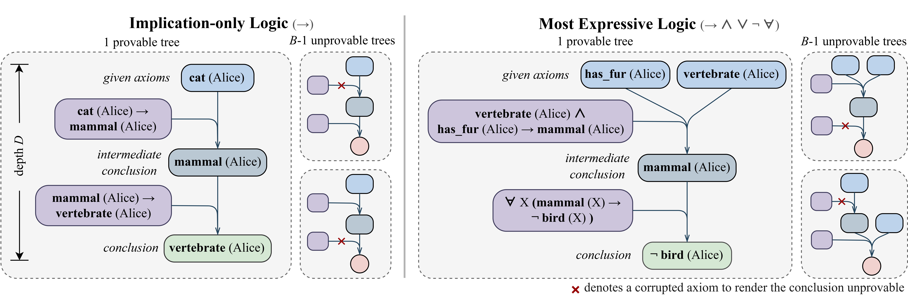
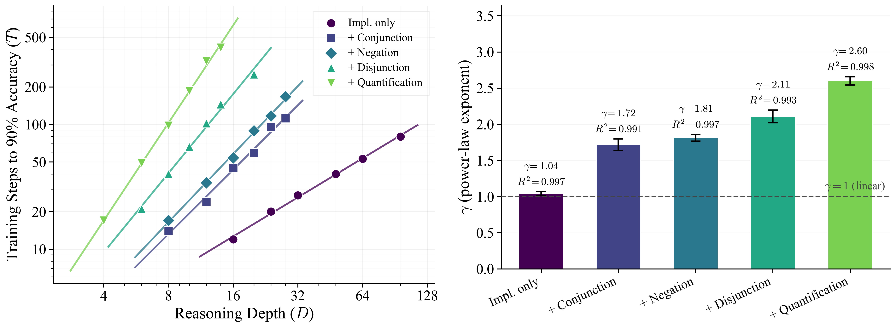

# ScaleLogic: Can RL Teach Long-Horizon Reasoning to LLMs? Expressiveness Is Key

[](https://arxiv.org/abs/2605.06638)

We build a controlled synthetic logical reasoning testbed where the *reasoning depth* of a problem and the *logical expressiveness* of the language are both dialed independently. Training a model with RL until it reaches 90% accuracy, we find the required training compute follows a clean power law in depth, $T \propto D^{\gamma}$ — and the exponent $\gamma$ grows monotonically with logical expressiveness (from 1.04 to 2.60). RL *can* teach long-horizon reasoning, but the cost of doing so is governed by how expressive the target logic is.

## Task overview

Each problem is a set of natural language facts plus $B$ candidate conclusions; exactly one conclusion is provable, the other $B-1$ are made unprovable by corrupting a single axiom in their proof tree. The **reasoning depth** $D$ is the length of the provable chain; the **logical expressiveness** controls which logical operators may appear: $\text{Implication-only} \subset \text{+ Conjunction} \subset \text{+ Negation} \subset \text{+ Disjunction} \subset \text{+ Quantification}$.



## Key findings

For every expressiveness setting, the RL training steps T required to reach 90% validation accuracy follow a power law in reasoning depth $D$ ($T \propto D^{\gamma}, R^2 \ge 0.99$). The fitted exponent $\gamma$ rises monotonically as more logical machinery is allowed, from near-linear ($\gamma \approx 1.04$) to strongly super-linear ($\gamma \approx 2.60$). And the downstream performances also depend strongly on the logical expressiveness of the training environment, with more expressive settings yielding larger and more compute-efficient transfer.



## Repository layout

```
.
├── data_generation/                          # 3-file synthetic-task generator
│   ├── aug_generator.py                      #   entry point (parquet emitter)
│   ├── generator.py                          #   graph generator
│   ├── graph_to_qa.py                        #   verbalize graph to MCQ
│   └── README.md
│
└── verl/                                     # vendored copy of verl 0.5.0 (Apache 2.0)
    ├── recipe/dapo/dapo_ray_trainer.py       # modified: adaptive early-stop hooks
    ├── verl/utils/reward_score/...     	  # added:    ScaleLogic reward scorer
    ├── scripts/                              # added:    training launchers
    │   ├── train.sh                          #             parameterized launcher
    │   ├── presets/                          #             one wrapper per setting
    │   └── README.md
    └── ...                                   # everything else: byte-identical upstream
```

## Environment

Data generation needs only `pip install datasets`. Training uses the vendored [verl](https://github.com/verl-project/verl/tree/main) — please install via `cd verl && pip install -e .` in a CUDA 12 env.

## Quick start

### 1.  Generate a dataset

```bash
python data_generation/aug_generator.py \
    --n_train 100000 --n_test 1000 \
    --total_edges 40 --depth 10 --branches 4 \
    --num_persons 2 --p_forall 0.5
```

This emits two parquet files in the current directory; see `data_generation/README.md` for all flags / expressiveness toggles.

### 2.  Train

```bash
# the simplest path: use a preset
bash verl/scripts/presets/4B_quantification_D10_B4.sh

# or override anything via env-vars
TRAIN_FILE=./my_train.parquet \
VAL_FILE=./my_test.parquet \
BASE_MODEL=Qwen/Qwen3-4B \
MAX_RESPONSE_LEN=8192 \
bash verl/scripts/train.sh
```

The trainer writes the per-step information to W&B (if `WANDB_API_KEY` is set) and tracks an early-stop threshold (default 90% validation accuracy). The number of optimizer steps at the time the threshold is hit is what we call `T_steps` in the paper. Checkpoints are saved as FSDP shards; merge them with `python -m verl.model_merger merge --backend fsdp ...` and evaluate with any standard benchmark harness.

## Citation

```bibtex
@article{wang2026can,
  title={Can RL Teach Long-Horizon Reasoning to LLMs? Expressiveness Is Key},
  author={Wang, Tianle and Wang, Zhaoyang and Lan, Guangchen and Wei, Xinpeng and Zhang, Sipeng and Qiu, Guanwen and Saparov, Abulhair},
  journal={arXiv preprint arXiv:2605.06638},
  year={2026}
}
```

## License

The vendored verl tree is Apache 2.0 (see `verl/LICENSE`). Our additions (data generators, modified DAPO trainer, reward scorer, training scripts) are released under MIT — see `LICENSE`.
